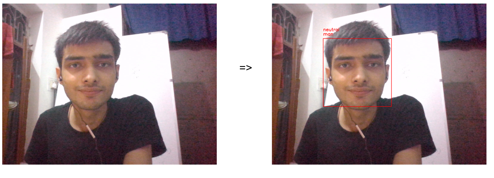

Vision System\
\
{width="2.176516841644794in"
height="2.8843930446194226in"}\
*Frontal Face Detection*\
The method used to detect the frontal face works same as OpenCV
Haar cascade method. The face detection feature provided by OpenCV was
created in 2001 based on the cascade classifier algorithm based
on boosting published by P.Viola and M. Jones\[Viola01\]. The object
detection algorithm developed by Viola and Jones can basically detect a
variety of objects, but it is a technology that has been specifically
applied to face detection and has been recognized for its speed and
accuracy.\
{width="3.9248556430446193in"
height="2.7131550743657042in"}\
\
Cascade Structure Step 1 uses one of the most useful similar-har filters
for face detection, and if it determines that it is not a face, no
subsequent similar-har filter calculations will be performed. If step 1
is passed, the five similar-har filters is used in step 2 to check if
it's not a face, and no face is determined, a later step of the check
won’t be performed. At step 3, micro facial area are detected by quickly
removing non-face areas.

*Gender Classification*\
Facial features are extracted from a frontal posed image. IMDB
dataset is used to train the gender classification model. CNN model
based on Xception is used to train gender as well as emotion classifier
and ADAM optimizer is used.\

*Emotion Classification*\
The architectures are trained with the ADAM optimizer. Seven basic
expressions like surprise, neutral, sad, happy, anger, disgust, fear is
considered. The model for emotion classification is trained using FER
2013 dataset and same Xception based model.\
\
*FER 2013 dataset -\
*The data consists of 48x48 pixel 28709 grayscale images of
faces. The faces have been automatically registered in dataset so that
the face is more or less centred and occupies about the same amount of
space in each image. Each face is categorized according to the facial
expression into one of the seven categories (0=Angry, 1=Disgust, 2=Fear,
3=Happy, 4=Sad, 5=Surprise, 6=Neutral).\
\
\
*Model-\
*The mini-Xception model is a fully-convolutional neural network
that contains 4 residual depth-wise separable convolutions, where each
convolution is followed by a batch normalization operation and a ReLU
activation function. The last layer applies a global average pooling and
a soft-max activation function to produce a prediction. This
architecture has approximately 60, 000 parameters. Figure displays the
complete final architecture which is referred to as mini-Xception.

{width="4.543351924759405in"
height="4.926818678915136in"}

THE RESULTS

> Results of the real-time emotion classification task in unseen faces
> can be observed. The complete realtime pipeline includes: face
> detection, emotion and gender classification.\
> \
> {width="3.1493055555555554in"
> height="1.1395833333333334in"}\
> {width="3.1493055555555554in"
> height="1.0263888888888888in"}\
> \
> {width="3.1493055555555554in"
> height="1.0506944444444444in"}\
> \
> The emotions over time can be plotted and the change in emotions can
> be used to comment the stress level. It can be represented as:\
> $Stress\  \propto \frac{1}{PE}$ $PE = Positive\ Emotions$
>
> {width="3.1493055555555554in"
> height="2.017361111111111in"}

{width="3.1493055555555554in"
height="2.279861111111111in"}
